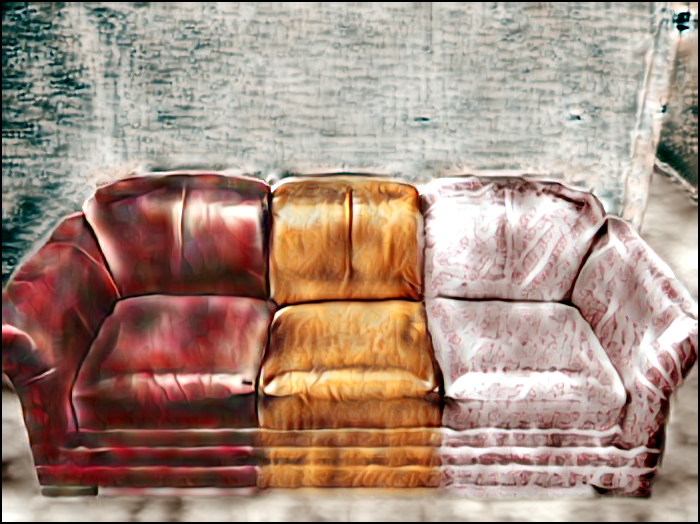

## Universal Style Transfer

This is the Pytorch implementation of [Universal Style Transfer via Feature Transforms](https://arxiv.org/pdf/1705.08086.pdf).

Official Torch implementation can be found [here](https://github.com/Yijunmaverick/UniversalStyleTransfer) and Tensorflow implementation can be found [here](https://github.com/eridgd/WCT-TF).

## Prerequisites
- [Pytorch](http://pytorch.org/)
- [torchvision](https://github.com/pytorch/vision)
- Pretrained encoder and decoder [models](https://drive.google.com/open?id=0B4NpdUmFkn_GRTFCMDlad083bjg) for image reconstruction only (download and uncompress them under models/)
- CUDA + CuDNN

## Prepare images
This implementation supports segmentation mask, but it's optional.
- If you don't want to use segmentation mask, simply put content and image pairs in `images/content` and `images/style` respectively. Note that correspoding conternt and image pairs should have same names.
- If you want to use segmentation masks, you need to put segmentation mask for content image and style image in `images/contentSeg` and `images/styleSeg`. Note all four images (content, style, segmentation for content and segmentation for style) should have same names.


## Style Transfer

```
python WCT.py --cuda
```

## Results
### Style Transfer with Segmentation Mask




Note: image and mask credit to Luan F, Paris S, Shechtman E, et al.

### Style Transfer without Segmentation Mask


### Acknowledgments
Many thanks to the author Yijun Li for his kind help.

### Reference
Li Y, Fang C, Yang J, et al. Universal Style Transfer via Feature Transforms[J]. arXiv preprint arXiv:1705.08086, 2017.
