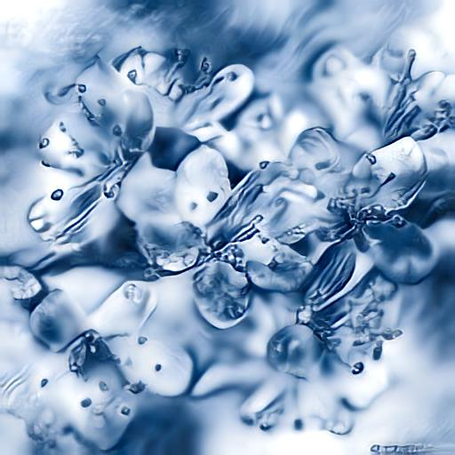
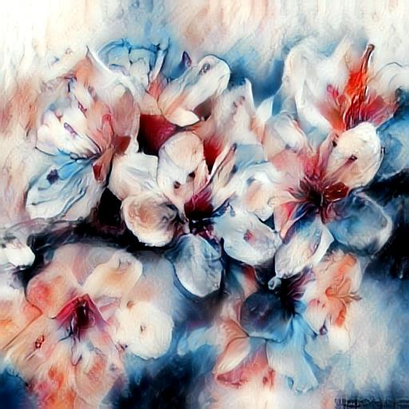
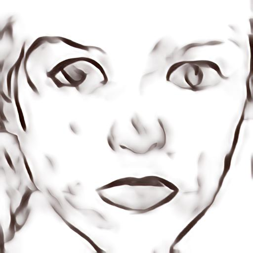
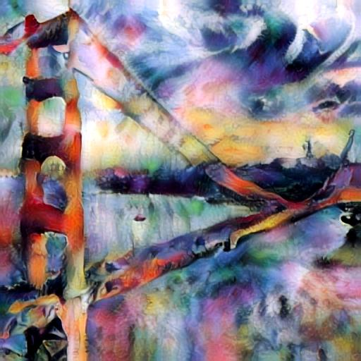

## Universal Style Transfer

This is a **modified** Pytorch implementation of [Universal Style Transfer via Feature Transforms](https://arxiv.org/pdf/1705.08086.pdf).

**It makes some modifications:** 

* Slightly improved parametrization introduced in [Unsupervised Learning of Artistic Styles with Archetypal Style Analysis](https://arxiv.org/abs/1805.11155)
  to control the preservation of detail vs the strength of stylization.
  This is most useful if you're modifying the style of an image that is *already* an artwork.
  But may also be of interest to preserve detail in photos.
  For the original parametrization, see [@sunshineatnoon's repository](https://github.com/sunshineatnoon/PytorchWCT) (or go back through the git log) until I manage to clean this up and have both neatly next to each other.
* Improved feature transforms as described by Lu et al. in [A Closed-form Solution to Universal Style Transfer](https://arxiv.org/abs/1906.00668).
  This specifically leads to better contour preservation.


The official Torch implementation can be found [here](https://github.com/Yijunmaverick/UniversalStyleTransfer) and Tensorflow implementation can be found [here](https://github.com/eridgd/WCT-TF).

## Prerequisites
- [Pytorch](http://pytorch.org/)
- [torchvision](https://github.com/pytorch/vision)
- [scikit-image](https://scikit-image.org)
- CUDA + CuDNN

## Prepare images
Simply put content and image pairs in `images/content` and `images/style` respectively. Note that correspoding conternt and image pairs should have same names.


## Style Transfer

```
python WCT.py --cuda
```

## Results







### Acknowledgments
Many thanks to the author Yijun Li for his kind help.

### Reference
Li Y, Fang C, Yang J, et al. Universal Style Transfer via Feature Transforms[J]. arXiv preprint arXiv:1705.08086, 2017.
